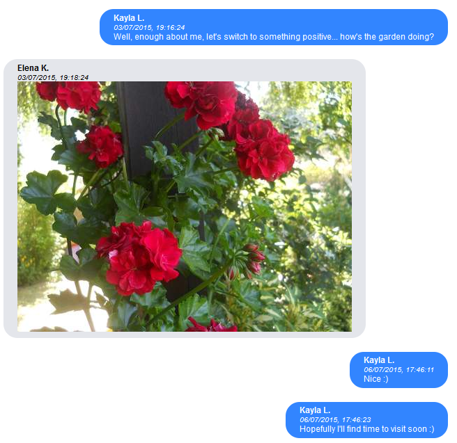

FB Message viewer 
=================

Viewer for Facebook message data that were downloaded as JSON using the "Your Facebook Information / Download Your Information" option.

The project consists of one self-sufficient local file that can be opened in a browser. Nothing else (except the data to view) is required, all is done locally and offline.

_Note: If you only want see the messages, it may be a better idea to download the Facebook data as HTML. But downloading in JSON enables further processing and/or changing how the data are rendered._

This was a quick project to view some old messages, since scrolling through them online on Facebook is slow. It also handles Facebook's special encoding of the data, which occurs when the data are downloaded as JSON. The data are decoded fully in JSON so the decoding code can be reused for other projects which need to manipulate with the data.

**How to use**

1. Request to download your Facebook information. You may uncheck everything except Messages, so the download file won't be large. Switch format to JSON. You may select lower media quality.
2. When ready, download the prepared file and unzip it.
3. (optional) Save message_viewer.html file next to the unziped files. It has to be at the same level as the "messages" directory. This is required step if you want to see pictures, videos and stickers in the chat.
4. Open the message_viewer.html file in the browser. If you want to see pictures and videos sent during the chat, make sure that you're opening the file from step 3.
5. On the page, browse through the files to find the conversation you're interested in (usually found in messages/index/person_name...). Select one of the .json files and it will be rendered on the page.

**Technical details**

Local/offline: all data are processed on the local machine and no data are sent anywhere.

There are couple of default settings in the code which may be changed to better suit your needs:

`var reverseOrder = true;` 
Older messages are shown first, change to false to have newer first.
		
`var fbSpecialDecoding = true;` 
JSON data exported from Facebook were encoded in a special way, every special byte was encoded as unicode endpoint with the same integer value as the byte, that's why additional code is in place to fix the encoding. Turn this off if you have preprocessed the text in some other way and the special code for decoding isn't needed anymore.
		
`var alwaysShowName = true;` 
For every message, name of the user is shown by default. Changing this to false will hide the name for direct messages. The names will be still shown for group chats or named chats.
		
